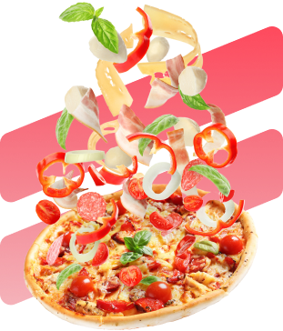
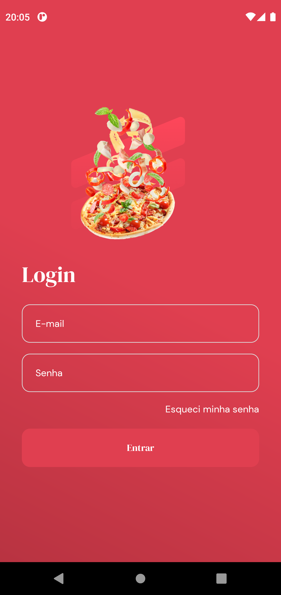
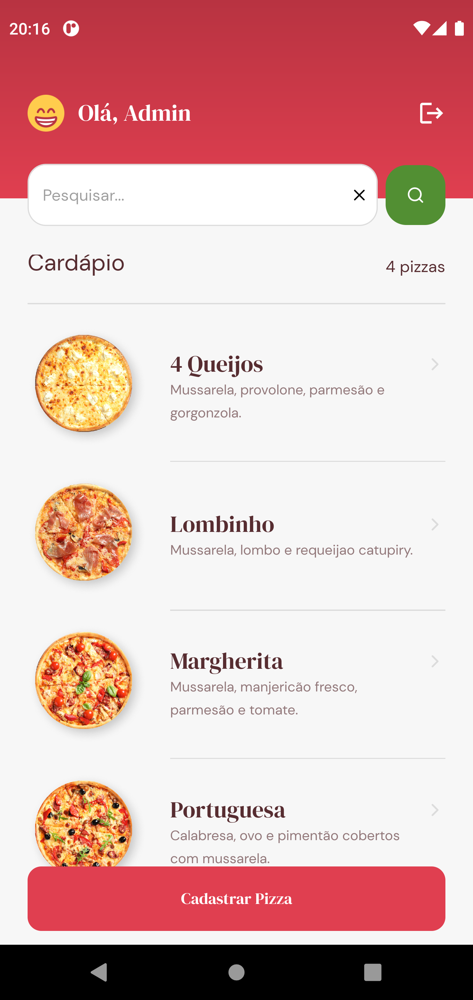
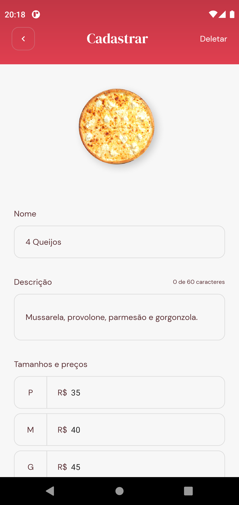
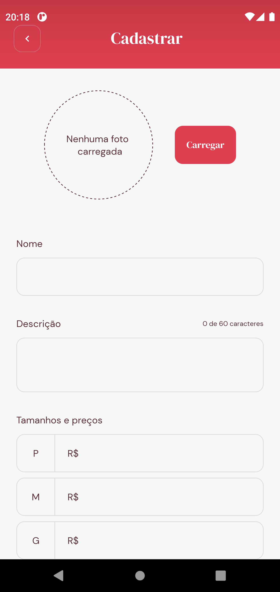
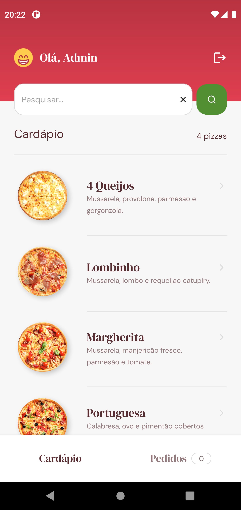
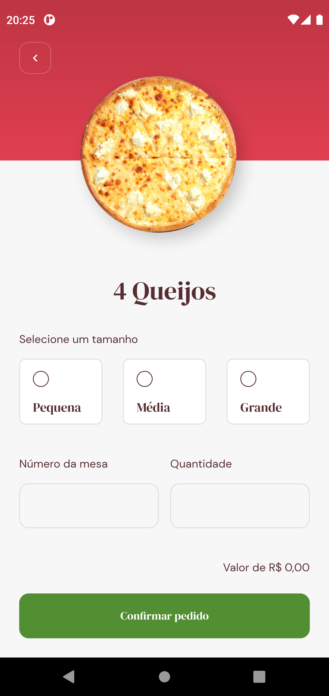
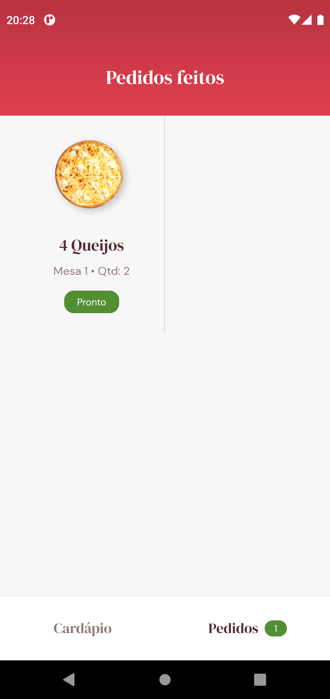
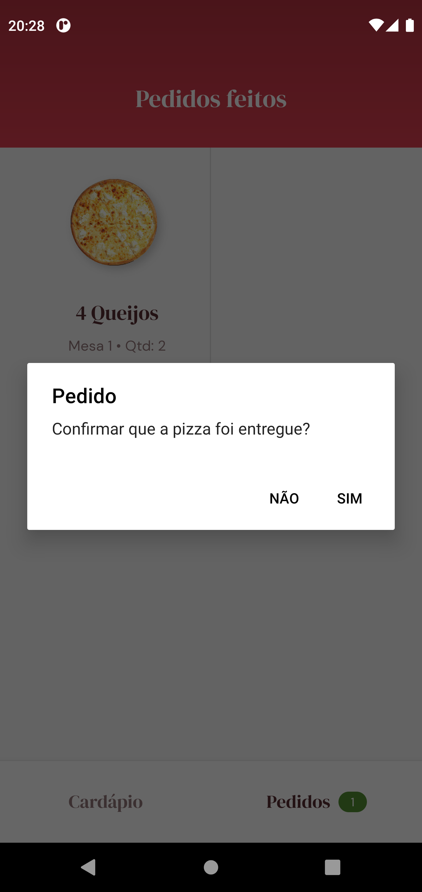
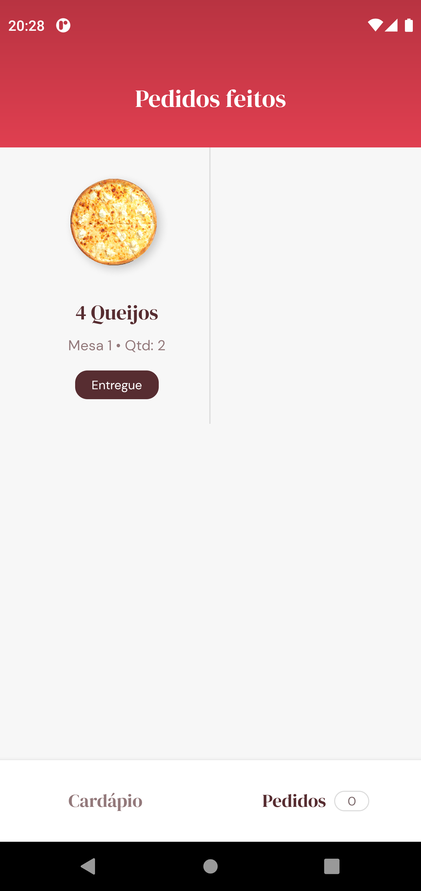

<p align="center">
  
  <br>
</p>
<h3 align="center">
  GoPizza, pizzas como você nunca viu!
</h3>

<br><br>

<p align="center">
  
  
  
  
</p>
<br>

<p align="center">
  <a href="#sobre">Sobre</a> •
  <a href="#goPizza">goPizza</a> •
  <a href="#instalação">Instalação</a> •
  <a href="#tecnologias">Tecnologias</a> •
  <a href="#autor">Autor</a>  
</p>

<br><br>

## Sobre

O GoPizza é uma aplicação voltada para pizzarias que foi desenvolvida durante o bootCamp Ignite da RocketSeat na trilha de React Native. A ideia foi, além de fixar os conceitos básicos do React Native, integrar nosso app com os serviços do Firebase.

## goPizza

O GoPizza é uma aplicação criada em React Native cujo objetivo é servir como plataforma de atendimento para pizzarias. A aplicação possui dois tipos de usuários, cada qual com suas funcionalidades distintas dentro do app, as quais veremos mais abaixo.

Para logar na aplicação, os usuários, independentemente do tipo, devem informar seu e-mail e senha de acesso para se autenticarem na aplicação, conforme tela abaixo:



Caso o usuário tenha esquecido a senha, basta digitar seu e-mail e clicar no link de **Esqueci minha senha** para que um e-mail seja enviado para que ele reset sua senha.

Vamos agora detalhar as telas e funcionalidades dos nossos dois tipos de usuários:

### Usuário administrador

O usuário com perfil de administrador terá como responsabilidade cadastrar e remover pizzas conforme a disponibilidade dos sabores na pizzaria em que trabalha.

Ao logar na aplicação ele irá se deparar com a home, onde serão listadas as pizzas já disponíveis para os clientes, além disso terá a opção de buscar um sabor especifico ou ainda cadastrar um novo sabor no botão que está na parte inferior da tela, conforme imagem abaixo:



Ao clicar em uma das pizzas da lista será possível ver o cadastro completo dela ou realizar sua exclusão clicando no botão localizado no canto superior direito:



Caso o administrador desejar poderá realizar o cadastro de um novo sabor. Após clicar no botão de cadastro disponível na home, ele será direcionado para o formulário abaixo para preencher os dados da pizza:



E pronto, após informar os dados da nova pizza, ela já será disponibilizada para os clientes, fechando assim a lista de todas as ações possíveis para esse tipo de usuário.

Abaixo uma demonstração do aplicativo em funcionamento aonde é ilustrado a exclusão e cadastro de uma pizza:


### Usuário atendente

O usuário com perfil de atendente terá como responsabilidade cadastrar os pedidos das mesas das pizzarias, informando para a sua equipe quais os sabores, tamanhos e quantidades cada cliente está solicitando.

Ao logar na aplicação ele irá se deparar com a home, onde serão listados os sabores de pizzas disponíveis para pedidos na aba **Cardápio**, conforme exemplificado abaixo:



Após o cliente escolher o sabor desejado, o atendente irá clicar sobre ele e a tela abaixo será exibida para que ele preencha qual será o tamanho, a quantidade e qual é o número da mesa do cliente:



Com os pedidos registrados, o atendente responsável será notificado assim que algum de seus pedidos ficar pronto. Assim que estiver pronto, basta ele clicar no pedido e confirmar quando ele for entregue. Cada etapa desse fluxo está representada nas seguintes telas respectivamente:

|                       Pedido pronto                        |                     Confirmação de entrega                     |                     Pedido entregue                     |
| :--------------------------------------------------------: | :------------------------------------------------------------: | :-----------------------------------------------------: |
|  |  |  |

Abaixo uma demonstração do aplicativo em funcionamento aonde é ilustrado todas as etapas do pedido, da solicitação à entrega:


## Instalação

Antes de começar, você vai precisar ter instalado em sua máquina as seguintes ferramentas:
[Git](https://git-scm.com), [Node.js](https://nodejs.org/en/).
Além disto é bom ter um editor para trabalhar com o código como [VSCode](https://code.visualstudio.com/).

### 📱 Rodando o App

```bash
# Clone este repositório
$ git clone git@github.com:MrRioja/goPizza.git

# Acesse a pasta do projeto no terminal/cmd
$ cd goPizza

# Instale as dependências
$ npm install
# Caso prefira usar o Yarn execute o comando abaixo
$ yarn

# Execute a aplicação
$ yarn start

# Será aberto no terminal o menu do Expo onde poderá scanear o QR Code para executar o app diretamente no seu celular ou as opções de executar no emulador android ou iOS
```

## Tecnologias

[](https://skillicons.dev)

## Autor

<div align="center">

<h1>Luiz Rioja</h1>
<strong>Backend Developer</strong>
<br/>
<br/>

<a href="https://linkedin.com/in/luizrioja" target="_blank">

</a>

<a href="https://github.com/mrrioja" target="_blank">

</a>

<a href="mailto:lulyrioja@gmail.com?subject=Fala%20Dev" target="_blank">

</a>

<a href="https://api.whatsapp.com/send?phone=5511933572652" target="_blank">

</a>

<a href="https://join.skype.com/invite/tvBbOq03j5Uu" target="_blank">

</a>

<br/>
<br/>
</div>
